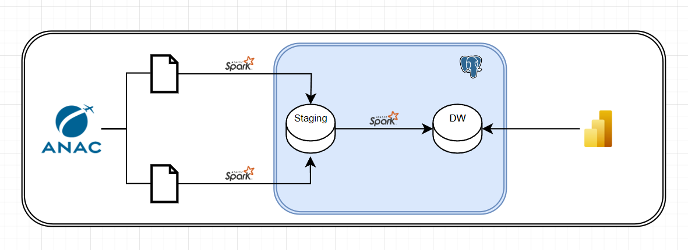

# Dados ANAC

### Aviação Nacional e Internacional

- Utilizei arquivos CSV, que possuem os vôos, valor da tarifa, assentos vendidos e etc.
  ##### Estrutura dos arquivos
  ##### Internacional
  ANO
  MES
  EMPRESA
  ORIGEM
  DESTINO
  RETORNO
  CLASSE IDA
  CLASSE VOLTA
  TARIFA
  ASSENTOS
  ##### Nacional
  ANO
  MES
  EMPRESA
  ORIGEM
  DESTINO
  TARIFA
  ASSENTOS
   
- Os dados foram retirados do portal da ANAC o [DataSAS](https://sas.anac.gov.br/sas/downloads/view/frmDownload.aspx?tema=17).
- Para este projeto utilizei os dados de vôos nacionais e internacionais

#### Parte 1

- Para extrair os dados dos arquivos CSV, utilizei PySpark e depois conectei com o db staged. [Código](./scripts/loadStaged.py)

#### Parte 2

- Realizei o tratamento com os dados em staged, e após a finalização carregar no DW [Código](./scripts/transform.py)

#### Parte 3

- Criei um script que utiliza o Spark.sql para criar view e conseguemente criar minhas dimensões e fatos. [Código](./scripts/catalogar.py)
